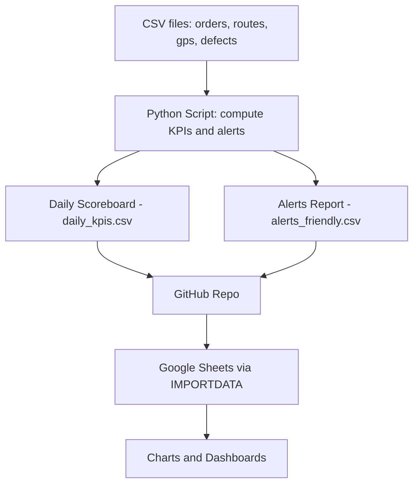

# Geo Stock Tracker
Last-Mile Route Intelligence + KPI Alerts

## Overview
In this project I’ve simulated an Amazon-style last-mile delivery analytics + alert system.
It ingests delivery orders, routes, GPS logs, and defect reports, then computes daily KPIs to evaluate delivery performance.
It also generates a human-friendly alert log so managers can quickly see where things are going wrong. 
To keep the data fresh, the ETL pipeline can be automated with GitHub Actions, which runs the script on a schedule (e.g., every morning), updates the KPI and alert CSVs, and pushes them back to the repo so Google Sheets and dashboards always stay up to date.

Check out the Google sheet here: [geo-stock-tracker-google-sheet](https://docs.google.com/spreadsheets/d/16blGH2G9RyK0cQiUXRE9sEUZcc2qZ4q6YvGsXa0pbKE/edit?usp=sharing)

---

## Pipeline
Simple View



---
Technical View flowchart LR

    subgraph Input
        A1[orders.csv]
        A2[routes.csv]
        A3[gps_logs.csv]
        A4[defects.csv]
    end

    subgraph ETL
        B[compute_lastmile_kpis.py]
    end

    subgraph Output
        C1[daily_kpis.csv]
        C2[alerts_friendly.csv]
    end

    subgraph Repo
        D[GitHub Repo\n(main branch)]
    end

    subgraph Automation
        E[GitHub Actions\nscheduled run]
    end

    subgraph Serve
        F[Google Sheets IMPORTDATA]
        G[Charts & Dashboards]
    end

    A1 --> B
    A2 --> B
    A3 --> B
    A4 --> B
    B --> C1
    B --> C2
    C1 --> D
    C2 --> D
    D --> F
    E --> B
    F --> G

## Data Sources
Synthetic datasets (CSV files in `/data`):

- `orders.csv` – each delivery order with promised vs actual delivery timestamps  
- `routes.csv` – planned route schedule, type, and SLA info  
- `gps_logs.csv` – per-route GPS trace (location, speed, idle time)  
- `defects.csv` – defect events (NDR, late, damaged, etc.)
---
## KPIs Tracked
- On-Time Delivery Rate (OTD) – % of deliveries before promised time  
- Defect Rate – % of orders with a defect (lost, damaged, late, NDR)  
- First-Attempt Success – % delivered on first try  
- Stops per Hour – delivered orders ÷ driver active hours  
- Route Duration vs SLA – actual vs target route duration  
- Distance Variance – actual vs planned distance  
- Idle Time Ratio – % of time idling while engine on  

---

## Alerts
Alerts are written to `data/alerts_friendly.csv` in a plain-English format:

| Date       | Station | Route         | KPI Alert                  | Details                                | Severity  |
|------------|---------|---------------|----------------------------|----------------------------------------|-----------|
| 2023-05-01 | BOS-3   | R-2023-05-01-A | On-Time Delivery below target | OTD was 85.7% vs target 95%            | WARN      |
| 2023-05-01 | BOS-3   | R-2023-05-01-A | Defect Rate too high       | Defect Rate was 6.7% vs target 2%       | CRITICAL  |

---

## Architecture
- Ingestion → CSVs  
- Transform → Python (Pandas)  
- Storage → Outputs saved back to `/data`  
- Serving → Google Sheets (`IMPORTDATA`) or Looker Studio for dashboards  

---

## How to Run
1. Clone the repo:
   ```bash
   git clone https://github.com/jpayal0110/geo-stock-tracker.git
   cd geo-stock-tracker
